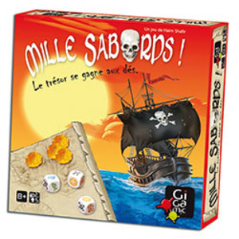

# 1000 sabords

Mille sabords est un jeux de société d'Haim Shafir, illustré par Jose Pedro, édité et distribué par Gigamic.

## Description
Sur le thème des pirates, Mille sabords est un jeux de dès ressemblant au Yams.
lancez les dés et tentez de réaliser la meilleure combinaison : vous pouvez relancer autant de fois que vous le souhaitez mais attention aux 3 têtes de mort ou vous rentrerez les mains vides ! 

