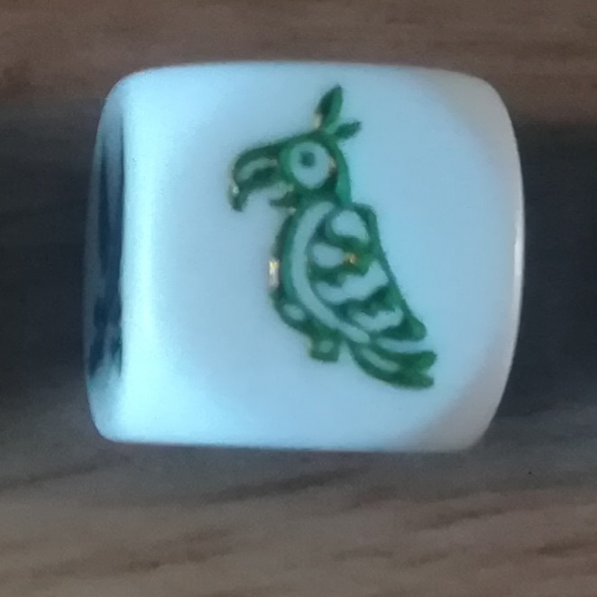
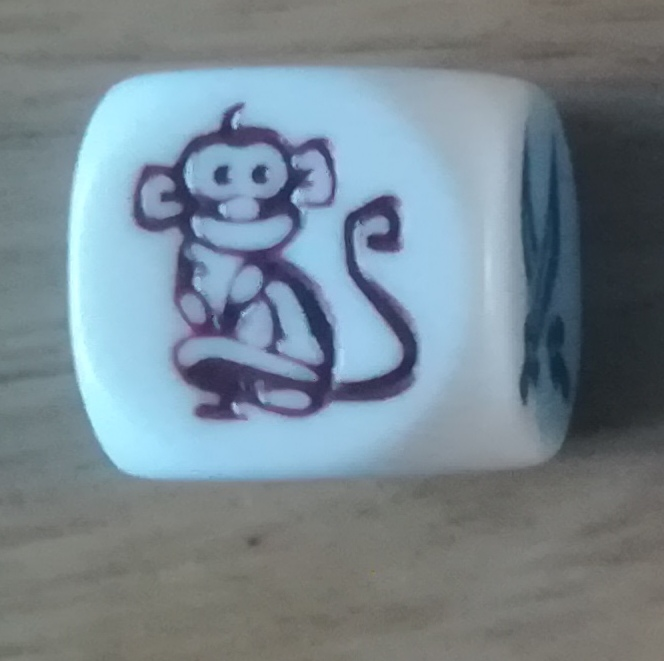
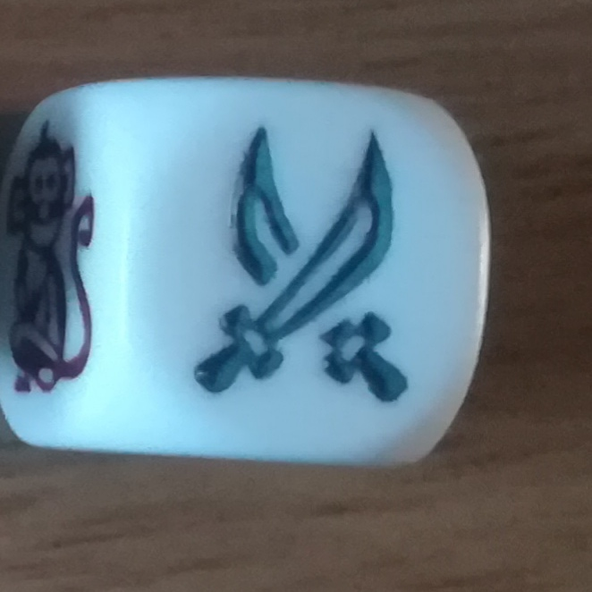
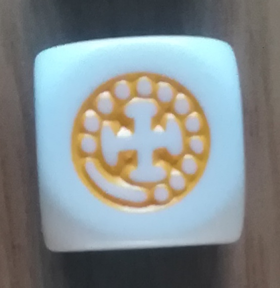
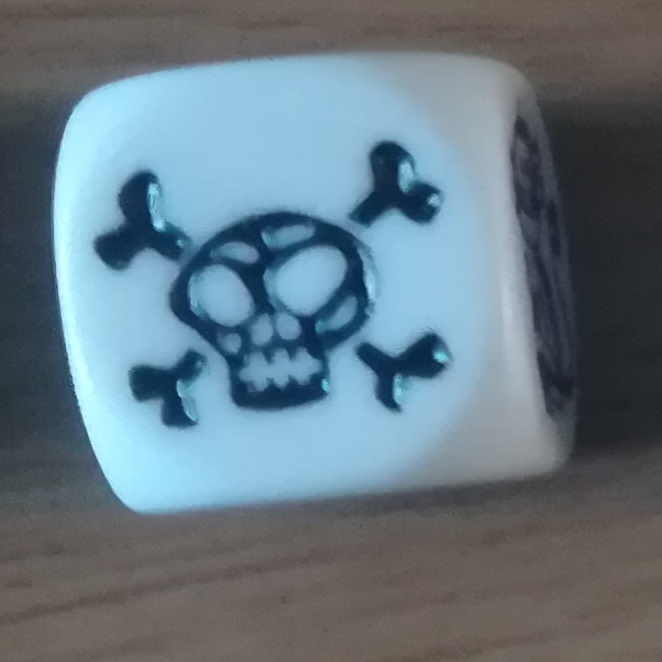
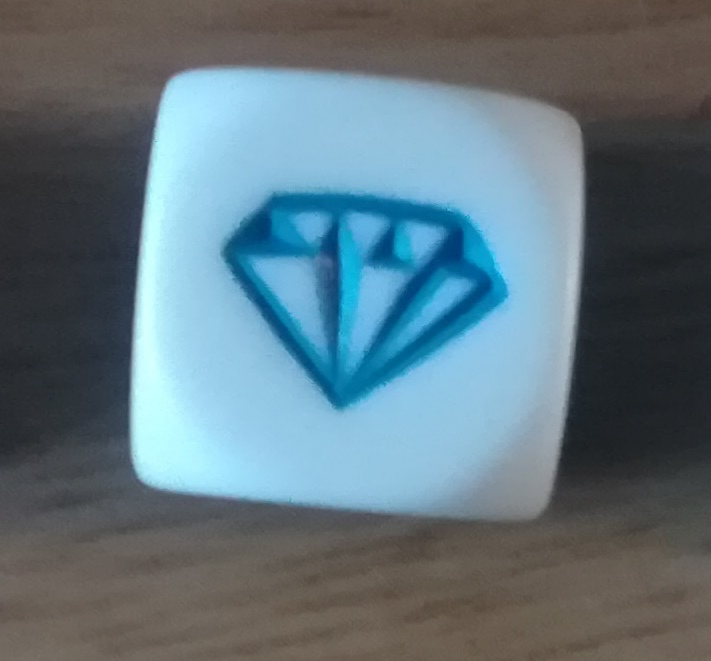

# Des diamands et des piéces

Mille sabords se joue avec 8 dés à 6 faces. Les dés sont identiques:

  
  
  
  
  
  

Vous devez évaluer le score d'un lancé de dés.

Chaque face "Pièce" ou "Diamant" donne 100 points.

Exemple, un lancé: SKULL/DIAMOND/DIAMOND/PARROT/COIN/PARROT/MONKEY/MONKEY 

équivaut à 300 point (DIAMOND + DIAMOND + COIN)

  <a href="/katas/sabords/iteration02.html">Go to Itération 2</a>  

